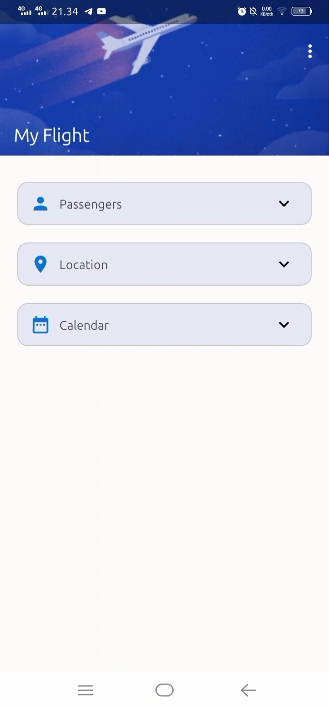
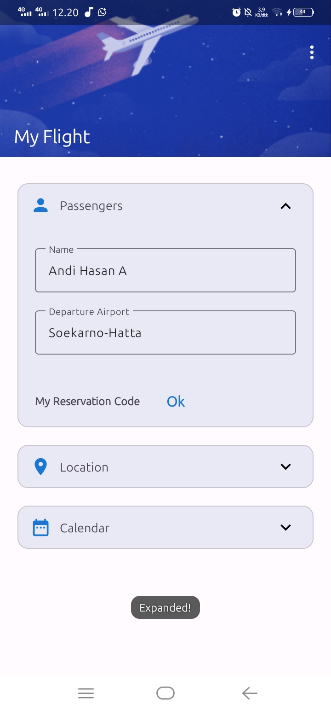
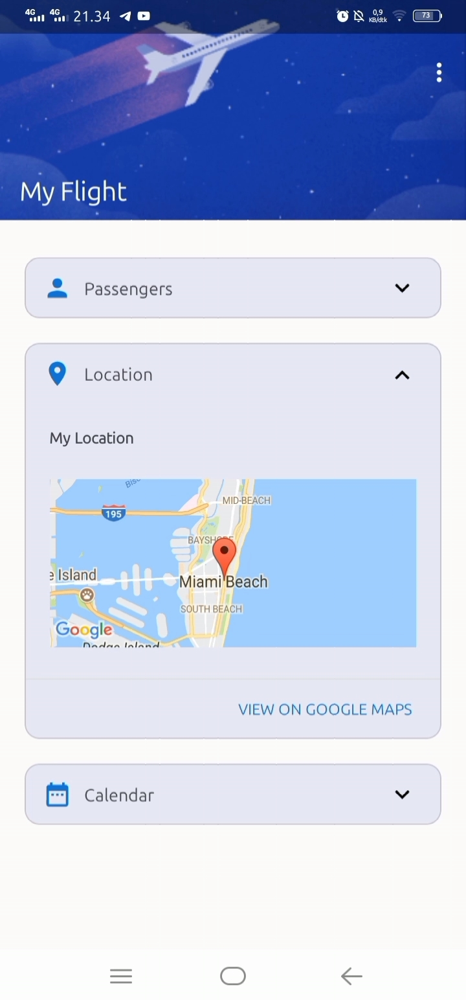
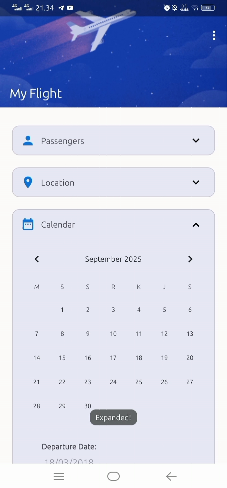

## FoldableCardView
An Android library that lets you create in a simple, fast and hassle-free way a CardView in which you can insert your custom layout and just expand and collapse without even writing a single Java/Kotlin line of code.

This code is taken from [AleSpero](https://github.com/AleSpero/ExpandableCardView.git), then I changed and rewrote it using ViewBinding and Material Design 3.

### New version (with Material Design 3)
<div align="center">





</div>

### Old version


## Setup

First of all, include the dependency in your app build.gradle.kts:

```gradle.kts
implementation("com.github.hasanelfalakiy:foldable-cardview:${version}")
```

Or get the aar in the [Releases](https://github.com/hasanelfalakiy/FoldableCardView/releases/latest) section.

## Declaring the view

After you have the Library correctly setup, just declare the FoldableCardView in your xml:

```xml
<com.andihasan7.foldablecardview.FoldableCardView
    android:id="@+id/profile"
    android:layout_width="wrap_content"
    android:layout_height="wrap_content"
    app:title="Passengers"
    app:icon="@drawable/ic_person"
    app:inner_view="@layout/mycustomview"
    app:expandOnClick="true"
    app:animationDuration="300"
    app:startExpanded="false"/>
```
The only required attributes are `inner_view` and `title`. The other attributes are optional.

You can specify a custom title and icon on the header on the card by setting the attribute ```app:title``` and  ```app:icon``` respectively.

After you created the base xml, just create your custom layout and place it inside your ```layout``` folder.

Now just pass your newly created layout resource to the ```app:inner_view``` attribute. By setting the attribute ```app:expandOnClick="true"``` the card will have a default behaviour (expand/collapse on click); By setting the `animationDuration` attribute you can set a custom animation time, and by setting the `startExpanded` attribute the card will be automatically expanded when inflated.

Done! Now your FoldableCardView is ready to roll.

## Usage

If you want some basic Foldable Card without any custom behaviour, setting the view in the XML is enough. Otherwise just declare your FoldableCardView in your Activity/Fragment and you're ready to use its methods.

### Java
```java
FoldableCardView card = binding.profile;

 //Do stuff here
```
### Kotlin

```kotlin
val card : FoldableCardView = binding.profile

 //Do stuff here
```

You can use ```expand()``` and ```collapse()``` to respectively expand and collapse the card, and use ```isExpanded()``` to check if the card is expanded or not.
You can change the title and icon of the card dynamically by using ```setTitle()``` and ```setIcon()``` methods.

You can also set an OnExpandedListener to the card:

### Java
```java
card.setOnExpandedListener(new OnExpandedListener() {
    @Override
    public void onExpandChanged(View v, boolean isExpanded) {
        Toast.makeText(applicationContext, isExpanded ? "Expanded!" : "Collapsed!", Toast.LENGTH_SHORT).show();
    }
});
```
### Kotlin

```kotlin
card.setOnExpandedListener { view, isExpanded ->
    Toast.makeText(applicationContext, if(isExpanded) "Expanded!" else "Collapsed!", Toast.LENGTH_SHORT).show()
 }
```
## Contribute

This library is still in its early stages, so feel free to contribute. I will review any Pull Request in 24-48 hours.

## Modificator
Modified By [Andi Hasan A](https://github.com/hasanelfalakiy) with the help of AI

- [Telegram](https://t.me/moonelfalakiy)
- [Grup diskusi Telegram](https://t.me/moonlight_studio01/9)

If you liked this library, why don't you offer me a coffee (or a beer? :D)

BTC: 12cMBR8UNhnFyJ1cSyFGdqfjnfN2wK1wYX

ETH: 0x1ccdB57B51B14Bf3a451d5861B531b931Ad3BC45


## License

```
FoldableCardView

Copyright (C) 2025  Andi Hasan Ashari

This is free software: you can redistribute it and/or modify
it under the terms of the GNU General Public License as published by
the Free Software Foundation, either version 3 of the License, or
(at your option) any later version.

This is distributed in the hope that it will be useful,
but WITHOUT ANY WARRANTY; without even the implied warranty of
MERCHANTABILITY or FITNESS FOR A PARTICULAR PURPOSE.  See the
GNU General Public License for more details.

You should have received a copy of the GNU General Public License
along with this program.  If not, see <https://www.gnu.org/licenses/>.
```
Report to us if anyone violates the terms of the License, either by creating issues or writing to us directly.

